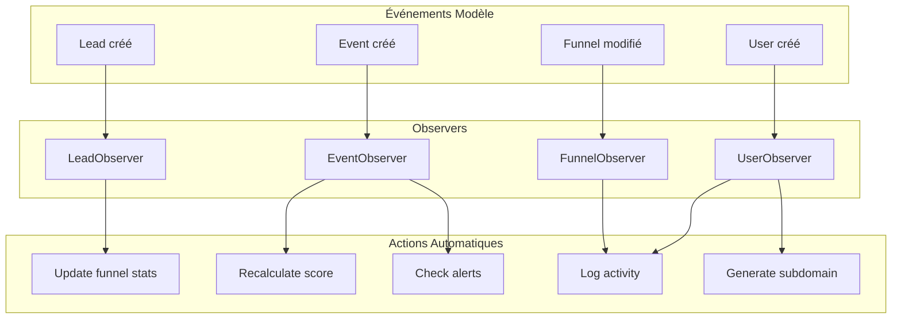

# Royal LeadMagnet - Architecture Complète

## Résumé

Architecture complète du **Back-Office Administrateur** avec:
- **Services Layer** pour la logique métier
- **Observers** pour les événements automatiques  
- **Onboarding** step-by-step pour une UX fluide

---

## 1. Architecture des Services

```
┌─────────────────────────────────────────────────────────────────┐
│                       SERVICES LAYER                            │
├─────────────────────────────────────────────────────────────────┤
│                                                                 │
│  OnboardingService                                              │
│  ├── getStatus() - Statut de l'onboarding                      │
│  ├── getSteps() - Liste des étapes                             │
│  ├── quickSetup() - Setup rapide en une fois                   │
│  └── setupTeam() - Configuration équipe commerciale            │
│                                                                 │
│  TenantService                                                  │
│  ├── create() - Créer un tenant                                │
│  ├── setupWithAdmin() - Créer tenant + admin                   │
│  └── updateBranding() - Mise à jour branding                   │
│                                                                 │
│  FunnelService                                                  │
│  ├── create() - Créer tunnel avec template                     │
│  ├── publish() - Publier un tunnel                             │
│  ├── duplicate() - Dupliquer un tunnel                         │
│  └── getAnalytics() - Statistiques du tunnel                   │
│                                                                 │
│  CommercialService                                              │
│  ├── createCommercial() - Créer un commercial                  │
│  ├── createGroup() - Créer un groupe                           │
│  ├── assignToGroups() - Assigner aux groupes                   │
│  └── getLeaderboard() - Classement commerciaux                 │
│                                                                 │
│  ScoringService                                                 │
│  ├── calculateScore() - Calculer score lead                    │
│  ├── recalculateScore() - Recalculer et sauvegarder           │
│  └── updateStatusFromScore() - Mettre à jour statut           │
│                                                                 │
│  AlertService                                                   │
│  ├── createAlert() - Créer une alerte                          │
│  ├── checkStatusChangeAlerts() - Alertes sur changement       │
│  └── checkInactiveLeads() - Alertes leads inactifs            │
│                                                                 │
│  TrackingService                                                │
│  ├── trackPageView() - Tracker vue de page                     │
│  ├── trackFormSubmit() - Tracker soumission formulaire        │
│  ├── trackVideoProgress() - Tracker progression vidéo         │
│  ├── trackWhatsAppClick() - Tracker clic WhatsApp             │
│  └── createLeadFromForm() - Créer lead depuis formulaire      │
│                                                                 │
│  LeadService                                                    │
│  ├── getLeads() - Récupérer leads avec filtres                │
│  ├── importFromCsv() - Importer leads                         │
│  ├── exportToArray() - Exporter leads                         │
│  └── getPipelineSummary() - Résumé du pipeline                │
│                                                                 │
└─────────────────────────────────────────────────────────────────┘
```

---

## 2. Architecture des Observers



---

## 3. Flux Onboarding Step-by-Step

```
┌─────────────────────────────────────────────────────────────────┐
│                    ONBOARDING WIZARD                            │
├─────────────────────────────────────────────────────────────────┤
│                                                                 │
│  Étape 1: BRANDING                                              │
│  └── Logo, couleurs, informations entreprise                   │
│                                                                 │
│  Étape 2: OFFRE                                                 │
│  └── Créer produit/service (Formation, Livre, MLM)             │
│                                                                 │
│  Étape 3: TUNNEL                                                │
│  └── Créer tunnel à partir d'un template                       │
│                                                                 │
│  Étape 4: PAGES                                                 │
│  └── Personnaliser le contenu des pages                        │
│                                                                 │
│  Étape 5: PUBLIER                                               │
│  └── Activer le tunnel, obtenir le lien                        │
│                                                                 │
│  Étape 6: ÉQUIPE (optionnel)                                    │
│  └── Inviter commerciaux, créer groupes                        │
│                                                                 │
│  Étape 7: ASSIGNER (optionnel)                                  │
│  └── Attribuer tunnels aux groupes commerciaux                 │
│                                                                 │
└─────────────────────────────────────────────────────────────────┘
```

---

## 4. Système Commercial avec Sous-domaines

```
TENANT (Organisation)
├── Admin créé les tunnels
├── Admin créé les groupes commerciaux
└── Admin assigne tunnels aux groupes

COMMERCIAL (User avec rôle 'commercial')
├── A un shop_name (nom de boutique)
├── A un subdomain personnel (dérivé du shop_name)
├── Appartient à des groupes commerciaux
└── Peut utiliser les tunnels de ses groupes

URL DU TUNNEL
├── URL de base: https://royalleadmagnet.com/f/{slug}
└── URL commercial: https://{subdomain}.royalleadmagnet.com/f/{slug}

LEAD (Prospect)
├── assigned_to: Commercial assigné pour suivi
└── brought_by: Commercial qui l'a apporté via son lien
```

---

## 5. Structure des Fichiers

```
app/
├── Enums/                      # 8 Enums
│   ├── AlertType.php
│   ├── BlockType.php
│   ├── EventType.php
│   ├── FunnelStatus.php
│   ├── LeadStatus.php
│   ├── OfferType.php
│   ├── PageType.php
│   └── UserRole.php
│
├── Events/
│   └── LeadStatusChanged.php
│
├── Listeners/
│   └── HandleLeadStatusChange.php
│
├── Models/                     # 14 Models
│   ├── Alert.php
│   ├── Block.php
│   ├── CommercialGroup.php
│   ├── Event.php
│   ├── Funnel.php
│   ├── Lead.php
│   ├── Note.php
│   ├── Offer.php
│   ├── Page.php
│   ├── ScoringRule.php
│   ├── Tag.php
│   ├── Template.php
│   ├── Tenant.php
│   └── User.php
│
├── Observers/                  # 4 Observers
│   ├── EventObserver.php
│   ├── FunnelObserver.php
│   ├── LeadObserver.php
│   └── UserObserver.php
│
├── Services/                   # 8 Services
│   ├── AlertService.php
│   ├── CommercialService.php
│   ├── FunnelService.php
│   ├── LeadService.php
│   ├── OnboardingService.php
│   ├── ScoringService.php
│   ├── TenantService.php
│   └── TrackingService.php
│
└── Traits/                     # 4 Traits
    ├── BelongsToTenant.php
    ├── HasScore.php
    ├── HasSettings.php
    └── Trackable.php
```

---

## 6. Exemples d'Utilisation

### Onboarding Quick Setup

```php
$onboarding = app(OnboardingService::class);

// Setup rapide: Offre + Tunnel + Pages en une fois
$result = $onboarding->quickSetup($tenant, [
    'offer_name' => 'Formation MLM Africain',
    'offer_type' => 'mlm',
    'offer_price' => 97000,
    'funnel_name' => 'Tunnel MLM',
    'template' => 'mlm',
    'whatsapp_url' => '+237699000000',
]);

// Setup équipe commerciale
$team = $onboarding->setupTeam($tenant, [
    'group_name' => 'Équipe Facebook',
    'commercials' => [
        ['name' => 'Jean', 'email' => 'jean@ex.com', 'shop_name' => 'Jean Business'],
        ['name' => 'Marie', 'email' => 'marie@ex.com', 'shop_name' => 'Marie Academy'],
    ],
    'funnel_ids' => [$result['funnel']->id],
]);
```

### Tracking des Événements

```php
$tracking = app(TrackingService::class);

// Créer un lead depuis formulaire
$lead = $tracking->createLeadFromForm($funnel, [
    'email' => 'prospect@gmail.com',
    'first_name' => 'Prospect',
    'phone' => '+237699000000',
], $commercial);

// Tracker les événements
$tracking->trackPageView($lead, $page);
$tracking->trackVideoProgress($lead, $page, 75);
$tracking->trackWhatsAppClick($lead, $page);
$tracking->trackConversion($lead, ['amount' => 97000]);
```

### Gestion des Commerciaux

```php
$commercial = app(CommercialService::class);

// Créer un commercial
$user = $commercial->createCommercial($tenant, [
    'name' => 'Jean Mbeki',
    'email' => 'jean@example.com',
    'shop_name' => 'Jean Business Academy',
    'whatsapp_number' => '+237699000000',
]);

// URL personnalisée du commercial
echo $user->getFunnelUrl($funnel);
// → https://jean-business-academy.royalleadmagnet.com/f/formation-mlm
```

---

## 7. Accès au Back-Office

**URL**: `http://localhost:8000/admin`

**Identifiants**:
- Email: `admin@royal.com`
- Mot de passe: `password`

---

## 8. Prochaines Étapes

1. **Créer les Filament Resources** pour chaque modèle
2. **Wizard Onboarding** avec Filament
3. **Dashboard** avec widgets et statistiques
4. **Page Builder** visuel avec drag & drop
5. **Middleware Subdomain** pour routing commercial
6. **API Tracking** pour les pages publiques
