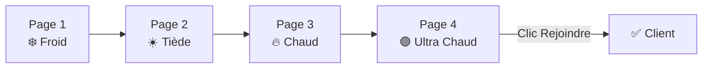

# 🏷️ Tags Automatiques — Progression Tunnel

## Vue d'ensemble

Système de tags automatiques assignés aux leads en fonction de leur progression dans le tunnel (funnel). Chaque tunnel est composé de **4 pages**, et à chaque page visitée, le lead reçoit automatiquement un tag reflétant son niveau d'engagement.

## Mapping Page → Tag → Statut

| Page | Tag | Couleur | Statut Lead | Slug |
|------|-----|---------|-------------|------|
| Page 1 | ❄️ **Froid** | 🔵 `#3B82F6` | `cold` | `froid` |
| Page 2 | ☀️ **Tiède** | 🟡 `#F59E0B` | `warm` | `tiede` |
| Page 3 | 🔥 **Chaud** | 🔴 `#EF4444` | `hot` | `chaud` |
| Page 4 | 🟣 **Ultra Chaud** | 🟣 `#8B5CF6` | `ultra_hot` | `ultra-chaud` |
| Clic "Rejoindre" (Page 4) | ✅ **Client** | 🟢 `#10B981` | `client` | `client` |

## Fichiers Modifiés

### 1. [app/Models/Page.php](file:///Users/apple/Desktop/ProjetClient/Royal-LeadMagnet/app/Models/Page.php)
- **[getPositionInFunnel()](file:///Users/apple/Desktop/ProjetClient/Royal-LeadMagnet/app/Models/Page.php#141-157)** — Détermine la position 1-based de la page parmi les pages actives
- **[isLastPage()](file:///Users/apple/Desktop/ProjetClient/Royal-LeadMagnet/app/Models/Page.php#158-169)** — Vérifie si c'est la dernière page du tunnel

### 2. [app/Services/TrackingService.php](file:///Users/apple/Desktop/ProjetClient/Royal-LeadMagnet/app/Services/TrackingService.php)
- **[assignFunnelProgressionTag()](file:///Users/apple/Desktop/ProjetClient/Royal-LeadMagnet/app/Services/TrackingService.php#411-466)** — Assignation automatique du tag + mise à jour du statut à chaque visite de page
- **[addProgressionTag()](file:///Users/apple/Desktop/ProjetClient/Royal-LeadMagnet/app/Services/TrackingService.php#467-487)** — Crée/récupère le tag avec couleur et auto_trigger
- **[markAsClient()](file:///Users/apple/Desktop/ProjetClient/Royal-LeadMagnet/app/Services/TrackingService.php#488-545)** — Conversion en Client lors du clic CTA sur la dernière page
- **[trackPageView()](file:///Users/apple/Desktop/ProjetClient/Royal-LeadMagnet/app/Services/TrackingService.php#107-125)** — Appelle [assignFunnelProgressionTag()](file:///Users/apple/Desktop/ProjetClient/Royal-LeadMagnet/app/Services/TrackingService.php#411-466) après chaque vue
- **[trackCtaClick()](file:///Users/apple/Desktop/ProjetClient/Royal-LeadMagnet/app/Http/Controllers/TrackingApiController.php#104-141)** — Appelle [markAsClient()](file:///Users/apple/Desktop/ProjetClient/Royal-LeadMagnet/app/Services/TrackingService.php#488-545) si CTA sur dernière page
- **[handleRepeatVisitor()](file:///Users/apple/Desktop/ProjetClient/Royal-LeadMagnet/app/Services/TrackingService.php#90-106)** — Ne gère plus le statut (délégué à la progression)

### 3. [app/Http/Controllers/TrackingApiController.php](file:///Users/apple/Desktop/ProjetClient/Royal-LeadMagnet/app/Http/Controllers/TrackingApiController.php)
- **[trackCtaClick()](file:///Users/apple/Desktop/ProjetClient/Royal-LeadMagnet/app/Http/Controllers/TrackingApiController.php#104-141)** — Nouvel endpoint API pour tracker les clics CTA

### 4. [routes/web.php](file:///Users/apple/Desktop/ProjetClient/Royal-LeadMagnet/routes/web.php)
- Route `POST /api/tracking/cta-click` ajoutée

### 5. [resources/views/funnel/blocks/button.blade.php](file:///Users/apple/Desktop/ProjetClient/Royal-LeadMagnet/resources/views/funnel/blocks/button.blade.php)
- JavaScript `trackCtaButtonClick()` pour envoyer l'événement CTA au backend

## Logique de progression

## Règles métier

> [!IMPORTANT]
> - **Pas de rétrogradation** : Si un lead est déjà "Chaud", revisiter la Page 1 ne le rétrograde pas à "Froid"
> - **Remplacement des tags** : Seul le tag de progression le plus avancé est conservé (les anciens sont retirés)
> - **Tag Client** : Remplace tous les tags de progression quand le lead clique sur "Rejoindre" (dernière page)
> - **Tags de score** : Les tags basés sur le score (`score_threshold_31`, `score_threshold_61`) restent indépendants et coexistent

> [!NOTE]
> La position de la page est calculée dynamiquement via [getPositionInFunnel()](file:///Users/apple/Desktop/ProjetClient/Royal-LeadMagnet/app/Models/Page.php#141-157). Ce n'est **pas** le `sort_order` brut, mais la position relative parmi les pages actives. Cela fonctionne même si des pages sont désactivées.
